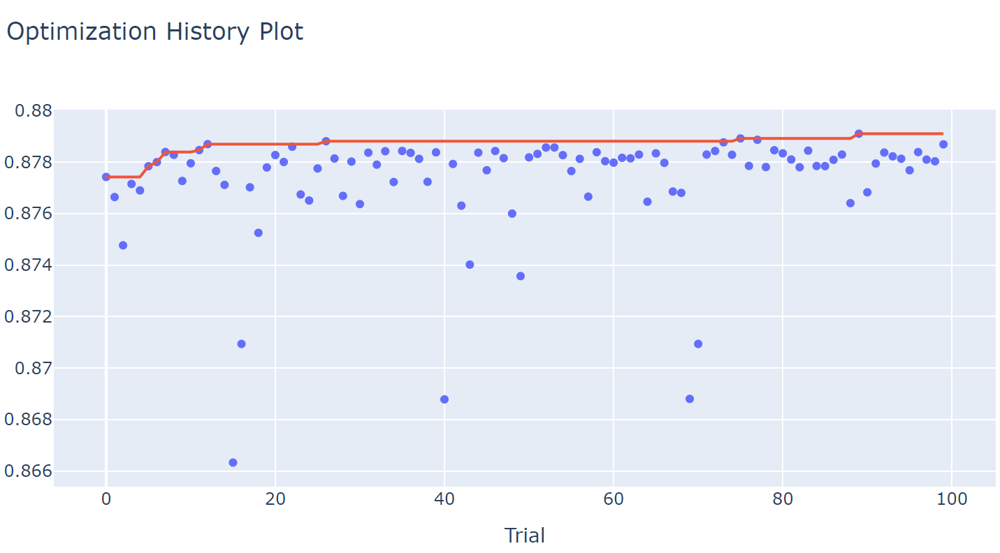
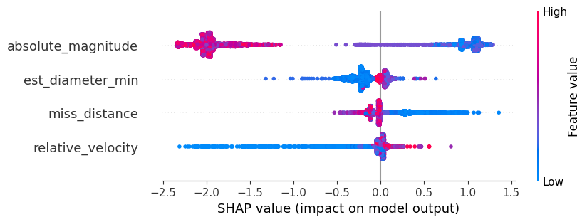

# Asteroid Hazardous Prediction with XGBoost and Optuna

This project uses machine learning to predict whether an asteroid is hazardous based on its physical characteristics, such as diameter, velocity, and distance from Earth. The model is built using **XGBoost**, and hyperparameter optimization is done using **Optuna**. The project also uses **SHAP** for model explainability and **Optuna Dashboard** for real-time optimization monitoring.

## Table of Contents
1. [Overview](#overview)
2. [Data Preprocessing](#data-preprocessing)
3. [Model Training and Hyperparameter Optimization](#model-training-and-hyperparameter-optimization)
4. [Visualizations](#visualizations)
5. [Model Explainability with SHAP](#model-explainability-with-shap)
6. [Optuna Dashboard](#optuna-dashboard)
7. [Installation](#installation)
8. [How to Run](#how-to-run)
9. [License](#license)

## Overview

The objective of this project is to classify asteroids as hazardous or non-hazardous using machine learning. The dataset consists of various attributes of asteroids, such as their size, speed, and distance from Earth. The classification task is framed as a **binary classification problem**, where the goal is to predict if an asteroid is hazardous based on available features

### Key Components:
- **XGBoost**: A powerful gradient boosting algorithm used to train the model.
- **Optuna**: A hyperparameter optimization framework that is used to tune the model’s parameters.
- **SHAP**: A tool for model interpretability that helps explain the predictions made by the trained model.
- **Optuna Dashboard**: Provides real-time monitoring of the optimization process.

## Data Preprocessing

The dataset is loaded from a CSV file and preprocessed in the following steps:
1. **Column Dropping**: Unnecessary columns like `id`, `name`, `orbiting_body`, and `est_max_diameter` are removed. Max and Min diameter are linearly dependant.
2. **Handling Imbalanced Dataset**: The dataset is imbalanced, with > 80% asteroids being non hazardous. We adjust the target class weight using the `scale_pos_weight` parameter in XGBoost, this helps the model to associate a greater training weight to the underrepresented class.
3. **Scaling**: All features are scaled using **StandardScaler**, specifically Z-Score. This option is made in order to put greater distances and different measure units at same basis to allow the model to effectively compare them.
4. **Target Variable Conversion**: The target variable `hazardous` is converted into integers (`0` for non-hazardous and `1` for hazardous).

## Model Training and Hyperparameter Optimization

The core part of the project is training an **XGBoost** model with hyperparameters optimized using **Optuna**. The process involves:
1. **Training/Validation Split**: During splitting, since this is an imbalanced dataset, it is advantageous to use stratified splitting during test and train. This assures that the minority class is properly represented in both datasets.
2. **Hyperparameter Search**: Optuna is used to optimize hyperparameters for the XGBoost model.
3. **Evaluation**: The model's performance is evaluated using **ROC AUC**.


## Visualizations

The following visualizations are generated using **Optuna**:
- **Optimization History**: Shows the progress of the optimization, including the best values found for each trial.



- **Parameter Importance**: Visualizes which XGBoost hyperparameters have the most influence on model performance. This helps us to understand the possible paths to further perform fine tunning.
- **Parallel Coordinates Plot**: Helps to explore interactions between hyperparameters and their impact on the model’s performance. This plot is useful to undertand, on a more granular basis, what are the parameters that had most influence for each trial.

## Model Explainability with SHAP

After training the model, the **SHAP** library is used to explain the model's predictions. SHAP provides:

- **Beeswarm Plot**: Displays the impact of each feature on the model's predictions. This helps understand which features contribute most to predicting whether an asteroid is hazardous. A great advantage of this plot is its interpretability, because we can assess, for each value region of the features, what is the effect (positive, negative, neutral) on final probability output.




## Dependencies:

You can install these dependencies using `pip`:

```bash
pip install pandas seaborn xgboost optuna shap plotly scikit-learn optuna-dashboard
